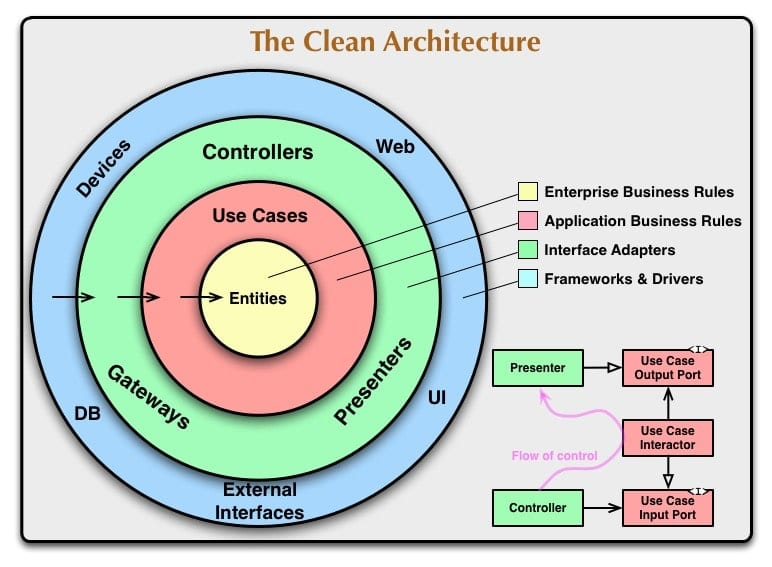

# odachin

## 開発者

### 井上歩久

担当

- CI/CD
- インフラ構築
- Backend
- Frontend
- 技術選定

コンペ入賞歴

- Atcoder(競技プログラミング): 水色
- Kaggle(データサイエンスコンペ): 銅メダル\*1
- nishika(データサイエンスコンペ): 3 位\*1
- Signate(データサイエンスコンペ): 銀メダル\*1

できること

- Web アプリ開発
  - 使用可能言語
    - Python
    - Golang
    - Rust
    - Java
    - TypeScript
    - JavaScript
- AI モデル開発(コンペの経験のみ、研究経験なし)
  - フレームワーク
    - PyTorch
    - scikit-learn 系
   
### 原田悠真

担当

- Backend
- Frontend

できること  
- Webアプリ開発
  - 使用可能言語
    - Python
    - Golang
    - Java
    - TypeScript
    - JavaScript

## 使用技術

- BackEnd
  - 使用言語: Golang
  - 通信プロトコル: http1.1 を[connect](https://connectrpc.com/)を使用して実装
  - スキーマ: [protobuf](https://protobuf.dev/)
  - ORM: GORM
  - Architecture: 以下の onion 型のアーキテクチャを採用
- FrontEnd
  - 使用言語: TypeScript
  - フレームワーク: [Next.js](https://nextjs.org/)
  - UI ライブラリ: [Chakra UI](https://chakra-ui.com/)
- インフラ
  - CI/CD: GitHub Actions.fornt と back をそれぞれ build して ECR に push+ECS にデプロイ
  - クラウド: AWS(ECS, ECR, S3)
